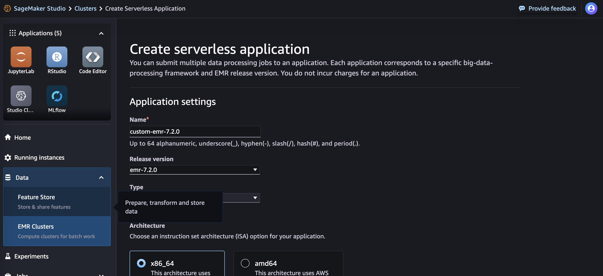
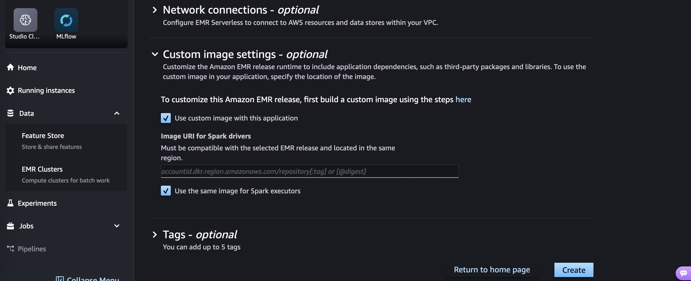
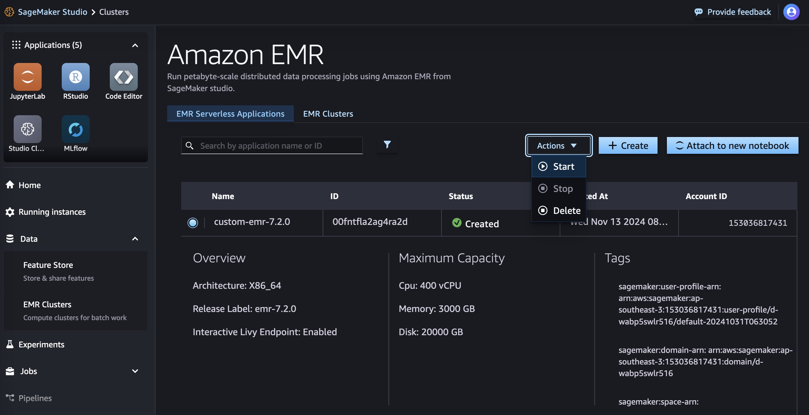

### Create ECR repo with policy to allow EMR Serverless
```bash
export REPO_NAME=emr-serverless-7.9.0/spark
export AWS_REGION=ap-southeast-3
aws --region $AWS_REGION ecr create-repository --repository-name $REPO_NAME --image-scanning-configuration scanOnPush=true
aws --region $AWS_REGION ecr set-repository-policy \
    --repository-name $REPO_NAME \
    --policy-text '{
    "Version": "2012-10-17",
    "Statement": [
        {
            "Sid": "EmrServerlessCustomImageSupport",
            "Effect": "Allow",
            "Principal": {
                "Service": "emr-serverless.amazonaws.com"
            },
            "Action": [
                "ecr:BatchGetImage",
                "ecr:DescribeImages",
                "ecr:GetDownloadUrlForLayer"
            ]
        }
    ]
}'

export REPO_URI=$(aws --region $AWS_REGION ecr describe-repositories --repository-name $REPO_NAME | jq -r '.repositories[0].repositoryUri')
echo $REPO_URI
```
### Preparing your Container image
Ref: https://docs.aws.amazon.com/emr/latest/EMR-Serverless-UserGuide/application-custom-image.html

### Push container image
login to ECR
```bash
aws ecr get-login-password --region $AWS_REGION | docker login --username AWS --password-stdin $REPO_URI
```
multi-arch container build
```bash
image_uri="${REPO_URI}:0.0.1"
docker buildx build --push --platform linux/arm64/v8,linux/amd64 -f Dockerfile.emr-serverless-7.9.0 -t $image_uri .
```

### Use in your Sagemaker Studio

* Create EMR Serverless Cluster from Sagemaker Studio. 
* Set custom image 
* Start EMR cluster and use it 

using CLI to [create EMR serverless application](https://docs.aws.amazon.com/cli/latest/reference/emr-serverless/create-application.html)

```bash
cat << EOF > emr-serverless-app.json
{
  "name": "my-emr-graviton",
  "releaseLabel": "emr-7.9.0",
  "type": "SPARK",
  "architecture": "ARM64",
  "interactiveConfiguration": {
    "studioEnabled": false,
    "livyEndpointEnabled": true
  },
  "workerTypeSpecifications": {
    "Driver": {
      "imageConfiguration": {
        "imageUri": "$image_uri"
      }
    },
    "Executor": {
      "imageConfiguration": {
        "imageUri": "$image_uri"
      }
    }
  },
  "autoStartConfiguration": {
    "enabled": true
  },
  "autoStopConfiguration": {
    "enabled": true,
    "idleTimeoutMinutes": 15
  }
}
EOF
aws emr-serverless create-application \
 --cli-input-json file://emr-serverless-app.json \
 --region $AWS_REGION
```