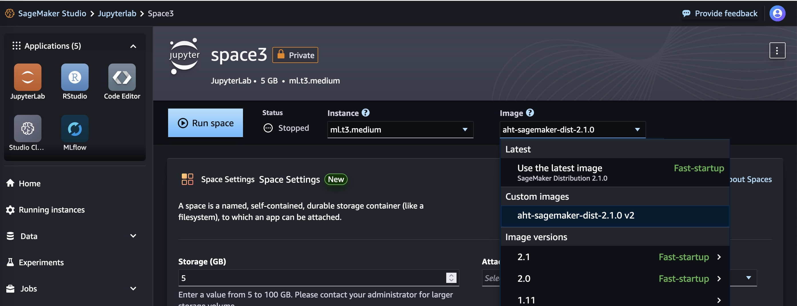
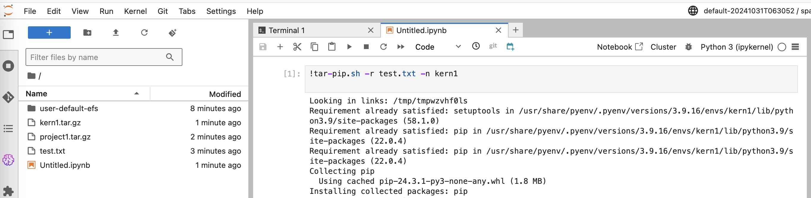

## About this image
What I would like to achieve here:
* extend the latest sagemaker jupyterlab image
* update libraries `jupyter-collaboration==3.0.0 jupyter_ydoc==3.0.0` in attempt to fix [this issue](https://github.com/jupyterlab/jupyter-collaboration/issues/351#issuecomment-2378986168) 
* add [script to modify livy client code](./hack-livyclient.sh)
* add [script to package requirements.txt into tar file and upload to S3](./tar-pip.sh)


### Build image

```bash
export REPO_NAME=sagemaker/sagemaker-distribution
export AWS_REGION=ap-southeast-3
export REPO_URI=$(aws --region $AWS_REGION ecr describe-repositories --repository-name $REPO_NAME | jq -r '.repositories[0].repositoryUri')
export IMG_TAG=3.1.0-cpu-with-q
# export IMG_TAG=2.1.0-cpu
image_uri=${REPO_URI}:$IMG_TAG
echo $image_uri
docker build -f Dockerfile.jupyterlab-$IMG_TAG -t $image_uri .
```

### Manually Test image
```bash
docker run --rm -it --entrypoint /bin/bash $image_uri
```

### Using the image in Sagemaker

Please refer to
* [this docs](https://docs.aws.amazon.com/sagemaker/latest/dg/studio-updated-jl-provide-users-with-images.html) to use custom image in Sagemaker domain
* [this cli command](https://awscli.amazonaws.com/v2/documentation/api/latest/reference/sagemaker/update-domain.html) to update Sagemaker domain via CLI

Make sure to add IAM permissions to list the sagemaker images to the role.
```bash
# push image to your ECR
aws ecr get-login-password --region $AWS_REGION | docker login --username AWS --password-stdin $REPO_URI
docker push $image_uri

# create Sagemaker app image config
aws sagemaker create-app-image-config --app-image-config-name default-jupyterlab --jupyter-lab-app-image-config {}
app_image_config_arn=$(aws sagemaker describe-app-image-config --app-image-config-name default-jupyterlab | jq -r .AppImageConfigArn)
echo $app_image_config_arn

# create Sagemaker image. change domain id
domain_id=d-xxx
image_name=aht-sagemaker-${IMG_TAG}
echo $image_name
role_arn=$(aws sagemaker describe-domain --domain-id $domain_id | jq -r .DefaultSpaceSettings.ExecutionRole)
aws sagemaker create-image --image-name $image_name --role-arn $role_arn
# create Sagemaker image version
aws sagemaker create-image-version --image-name $image_name \
  --base-image $image_uri
aws sagemaker describe-image-version  --image-name $image_name 

# update domain. set custom image for JupyterLabApp. rename ImageName below
aws sagemaker update-domain \
    --domain-id $domain_id \
    --default-user-settings '{
        "JupyterLabAppSettings": {
            "CustomImages": [
                {
                    "ImageName": "aht-sagemaker-3.1.0-cpu-with-q",
                    "AppImageConfigName": "default-jupyterlab"
                }
            ]
        }
    }'
```

With above setup, you should be able to see this custom image in drop down selection in your JupyterLab Space.


You can then use the [tar-pip.sh](./tar-pip.sh) from terminal or kernel.

Example of generating tar file from `test.txt` which contains python requirements.

