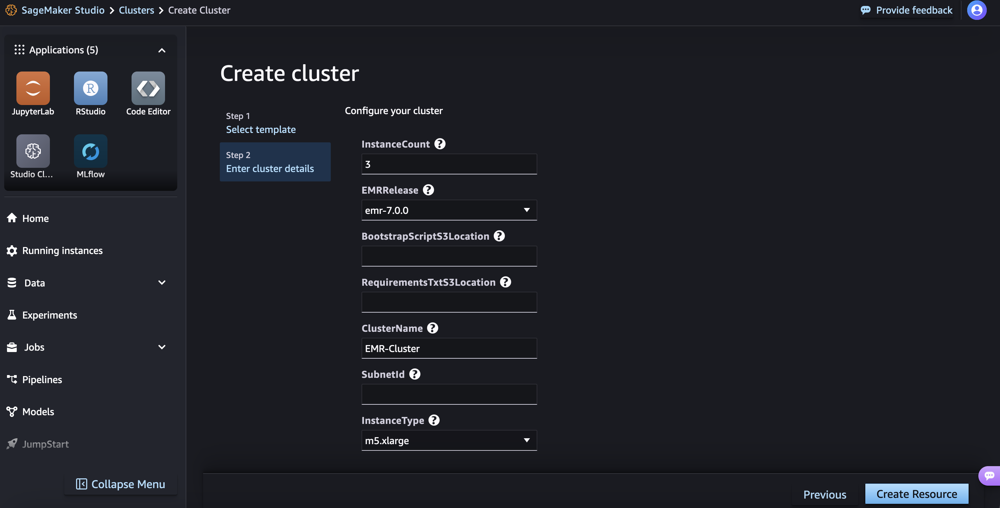

# Sagemaker-EMR Integration Guide

### Service Catalog with Parameterized Library

* ML Ops team can create EMR on EC2 cluster template from Service Catalog, so that it is  available in Sagemaker EMR Cluster option. Then, the data scientist will be able to start/stop the cluster on-demand.
* This example template parameterized the library installed in the cluster:
    * Parameterized `requirements.txt` location in S3 as input parameter
    * Use bootstrap script to run the `requirements.txt` during cluster creation
* The following is a sample of cloudformation Service Catalog template that takes in a custom parameter: [sc-emr.cfn](./emr-template/sc-emr.cfn)

```
...  
Parameters:
    RequirementsTxtS3Location:
        Type: String
        Description: S3 location of the requirements.txt file
        AllowedPattern: "^s3://[a-z0-9][a-z0-9.-]*[a-z0-9](/.*)?$"
    
    BootstrapScriptS3Location:
        Type: String
        Description: S3 location of the bootstrap script
        AllowedPattern: "^s3://[a-z0-9][a-z0-9.-]*[a-z0-9](/.*)?$"           
...
    
Resources:
EMRCluster:
    Type: AWS::EMR::Cluster
    Properties:
...
    BootstrapActions:
        - Name: InstallPythonDependencies
          ScriptBootstrapAction:
            Path: !Ref BootstrapScriptS3Location
            Args:
              - !Ref RequirementsTxtS3Location
...
```
  * This create a service catalog template where it can be selected from Sagemaker Studio
      


* Example of bootstrap script: [bootstrap-emr-script.sh](./emr-template/bootstrap-emr-script.sh)
* Example of `requirements.txt` file: [requirements.txt](./emr-template/requirements.txt)

* References
    * Main reference link: https://docs.aws.amazon.com/sagemaker/latest/dg/studio-notebooks-set-up-emr-templates.html
    * Networking between Sagemaker Domain and EMR: https://docs.aws.amazon.com/sagemaker/latest/dg/studio-notebooks-emr-networking.html

### Service Catalog with EMR GPU cluster support

We can also create a template to allow data scientist to create a cluster with GPU support. In this example, we are using an EMR Cluster with RAPIDS library that allow GPU accelerated spark query. Please refer to https://docs.aws.amazon.com/emr/latest/ReleaseGuide/emr-spark-rapids.html

* Select g5 as GPU instance, and add additional bootstrap to enable RAPIDS library. 
* The following is a sample of cloudformation Service Catalog template that takes in a custom parameter: [sc-emr.cfn](./emr-gpu-template/sc-emr.cfn)
```
    ...
  InstanceType:
    Type: String
    Default: "g5.xlarge"
    Description: EC2 instance type for the cluster nodes
    AllowedValues:
      - "g5.xlarge"
      - "g5.2xlarge"
      - "g5.4xlarge"
    ...
          BootstrapActions:
        - Name: InstallPythonDependencies
          ScriptBootstrapAction:
            Path: !Ref BootstrapScriptS3Location
            Args:
              - !Ref RequirementsTxtS3Location
        - Name: InstallRAPIDS
          ScriptBootstrapAction:
            Path: "s3://emr-test-117019135262/xldemo/service-catalog/bootstrap-rapids-script.sh"
    ...
```
* Example of additional bootstrap script: [bootstrap-emr-script.sh](./emr-gpu-template/bootstrap-rapids-script.sh)
* Example of `requirements.txt` file: [requirements.txt](./emr-gpu-template/requirements.txt)