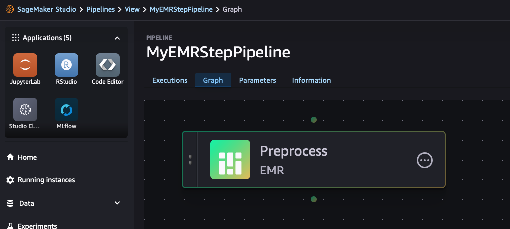

# Sagemaker-EMR Integration Guide

### EMR Step in Sagemaker Pipeline to run a GPU EMR cluster

* There are two options to do GPU computing: 1/ GPU notebook/training instance, or 2/ EMR Cluster with GPU.
* This guide will focus on the second option, to show how to create an EMR on EC2 cluster in a pipeline to run a GPU instance. This will be useful since EMR Serverless for upper environment does not have GPU instance yet.
  * **Development**: 
      * Create a GPU-based EMR cluster template in Service Catalog. 
      * Enable auto-termination for idle cluster to save cost.
  * **Upper Env**: 
      * Use EMR Step in Sagemaker Pipeline to automatically start an EMR Cluster, run the job, and stop the cluster once completed.
      * EMR Step will 1/Start a cluster, 2/Run the EMR steps, and 3/shutdown the cluster once finished.
      * This is how it would look like on the visual pipeline graph:
        
      * Example of how to build a the pipeline EMR Step are here: [emrpipeline-gpu.ipynb](./script/emrpipeline-gpu.ipynb)

     * The important part is shown below:
```
# This is a python script that creates a pipeline
...
emr_config = EMRStepConfig(
    jar="command-runner.jar",
    args=[
        "spark-submit",
        "--deploy-mode",
        "cluster",
        script,
        "--input",
        input_data,
        "--output",
        output_path,
    ],
)


step_emr = EMRStep(
    name="EMRStep",
    cluster_id=None,
    step_config=emr_config,
    display_name="Preprocess",
    description="preprocess data for XGBoost",
    cluster_config={
        "Applications": [
            {
                "Name": "Spark",
            }
        ],
        "Instances": {
            "InstanceGroups": [
                {"InstanceRole": "MASTER", "InstanceCount": 1, "InstanceType": "m5.xlarge"},
                {"InstanceRole": "CORE", "InstanceCount": 2, "InstanceType": "g5.xlarge"},
            ]
        },
        "BootstrapActions": [
            {
                "Name": "Install packages",
                "ScriptBootstrapAction": {
                    "Path": "s3://emr-test-117019135262/xldemo/service-catalog/bootstrap-emr-script.sh",
                    "Args": ["s3://emr-test-117019135262/xldemo/service-catalog/requirements-numpy.txt"]
                }
            },
            {
                "Name": "RAPIDS bootstrap",
                "ScriptBootstrapAction": {
                    "Path": "s3://emr-test-117019135262/xldemo/service-catalog/bootstrap-rapids-script.sh"
                }
            }
        ],
        "ReleaseLabel": "emr-7.3.0",
        "JobFlowRole": job_flow_role,
        "ServiceRole": service_role,
        "LogUri": "s3://aws-logs-117019135262-ap-southeast-3/elasticmapreduce"
    },
)

...
```
  * EMR Step can only run one step at a time. If you need to run multiple steps, then create the cluster first and submit multiple EMR Steps using an existing EMR Cluster ID.
  * Refer to the following references:
      * Sagemaker Pipeline EMR Step docs: https://docs.aws.amazon.com/sagemaker/latest/dg/build-and-manage-steps-types.html#step-type-emr
      * EMR Step uses the EMR RunJobFlow API, refer to this for the configuration: https://docs.aws.amazon.com/emr/latest/APIReference/API_RunJobFlow.html
      * Sagemaker SDK docs: https://sagemaker.readthedocs.io/en/stable/amazon_sagemaker_model_building_pipeline.html#emrstep
      * Example notebook that uses the EMR Step: https://github.com/aws/amazon-sagemaker-examples/blob/main/sagemaker-pipelines/tabular/emr-step/sagemaker-pipelines-emr-step-with-cluster-lifecycle-management.ipynb
  * Troubleshooting:
      * use `execution.describe()` in the notebook.
          Reference: https://boto3.amazonaws.com/v1/documentation/api/latest/reference/services/sagemaker/client/describe_pipeline_execution.html#
      * use `execution.list_steps()` in the notebook.

